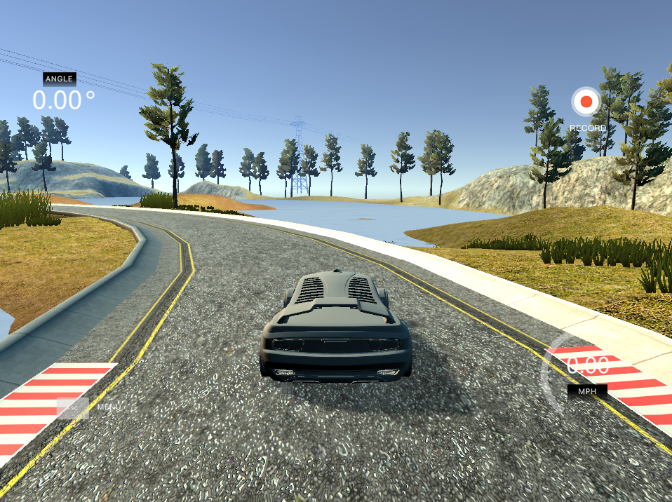

# Behaviorial Cloning Project
*Deep Learning and Convolutional Neural Networks.*

Overview
---

In this project we use deep neural networks and convolutional neural networks to clone driving behavior. We train, validate and test a model using Keras. The model's output is a steering angle to an autonomous vehicle. 

[This](https://github.com/udacity/CarND-Behavioral-Cloning-P3) Udacity's repository contains starting files for the Behavioral Cloning Project.

Udacity also have provided a [simulator](https://github.com/udacity/self-driving-car-sim) where we can steer a car around a track for data collection. We use image data and steering angles to train a neural network and then use this model to drive the car autonomously around the track.

My detailed solution **[writeup](https://github.com/feklistoff/udacity-carnd-project3/blob/master/Writeup_Project_3.md)**.

### The Project

---
The goals / steps of this project are the following:
* Use the driving simulator to collect data of good driving behavior
* Build a convolution neural network in Keras that predicts steering angles from images
* Train and validate the model
* Test that the model successfully drives around track one without leaving the road
* Summarize the results with a written report

This lab requires:

* [CarND Term1 Starter Kit](https://github.com/udacity/CarND-Term1-Starter-Kit)

or Python 3.5 and the following libraries installed:

* [Jupyter](http://jupyter.org/)
* [NumPy](http://www.numpy.org/)
* [Pandas](http://pandas.pydata.org/)
* [scikit-learn](http://scikit-learn.org/)
* [Open CV](http://opencv.org/)
* [TensorFlow](http://tensorflow.org)
* [Keras](https://keras.io/)

Additionally, if you'd like to use **`tensorflow-gpu`** on a local machine [this](https://medium.com/@ikekramer/installing-cuda-8-0-and-cudnn-5-1-on-ubuntu-16-04-6b9f284f6e77) article might be a great help.

The lab environment can be created with CarND Term1 Starter Kit. Click [here](https://github.com/udacity/CarND-Term1-Starter-Kit/blob/master/README.md) for the details.

