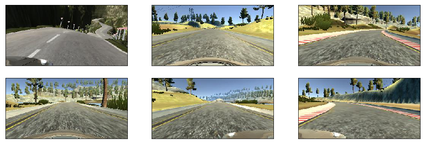
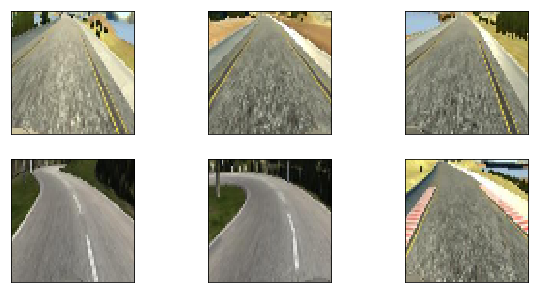
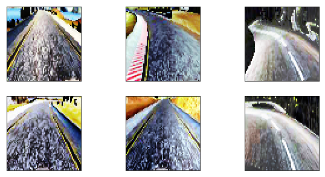
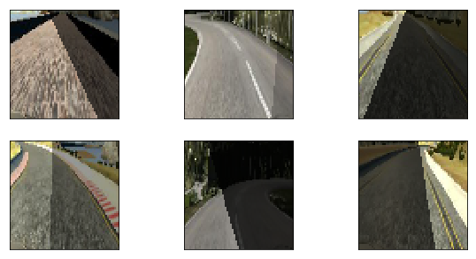
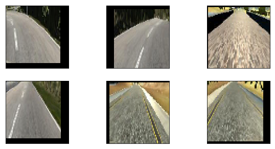
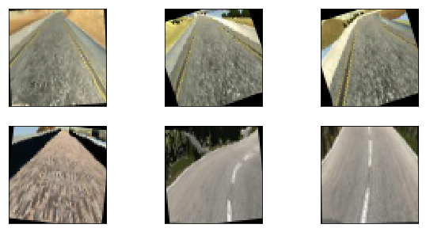
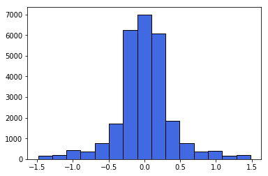
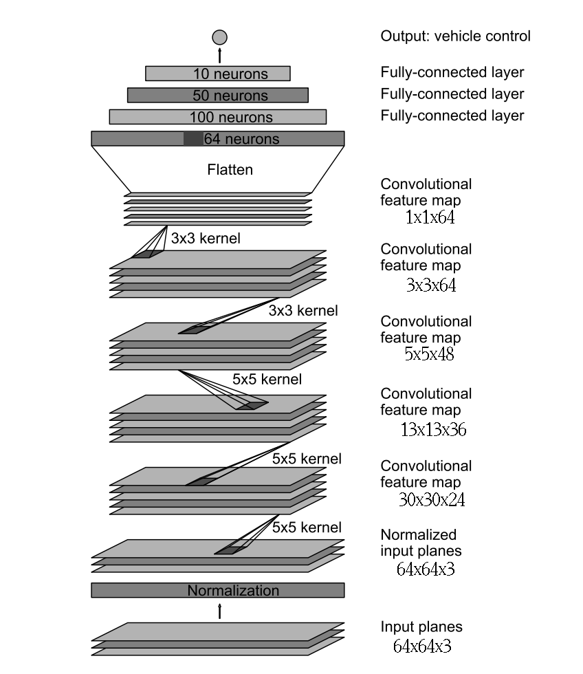
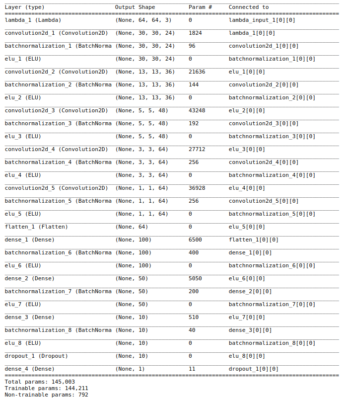
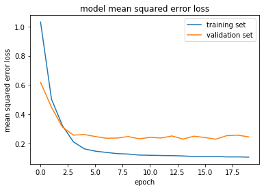

## **Behavioral Cloning Project**

### 1. Dataset overview

Initially, I recorded my driving on track one, there were two full laps (clockwise and counter-clockwise) and a few takes of 
two most difficult turns. However, that wasn't enough for the model (even with sophisticated data preprocessing pipeline) to
successfully drive on track two, so I ended up recording two laps of track two as well.
I had `12757` samples. Each sample was a shot from three cameras (left, center, right) and an angle value.

A few random images from the dataset:



When I plotted angles distribution I got this:


### 2. Dataset preprocessing

#### Dealing with angles

As we can see dataset contains a lot of '`0`' values. In order to fix this and to add some recovery to my data, as it is described [in this paper](http://images.nvidia.com/content/tegra/automotive/images/2016/solutions/pdf/end-to-end-dl-using-px.pdf) by NVIDIA, I devided dataset into three pieces using the fact that `-1 < angle < 1`:
* driving straight and add recovery if `-0.35 < angle < 0.35`
* turn left if `-0.55 < angle <= -0.35` and sharp turn left if `angle <= -0.55`
* turn right if `0.35 <= angle < 0.55` and sharp turn left if `angle >= 0.55`

#### Dealing with images

In order to make my model more robust I used these steps when dealing with images:
* First, I cropped and resized images. Cropped because I needed only bottom halves of images (where the road is) and resized to 64x64 because otherwise there were too many parameters.



* Images were corrected with `cv2.equalizeHist()`



* Next, random light and random shadow



* After that, a random shift



* Random rotation



* As NVIDIA suggested I used YUV color space

* And the final step, random flip

After all steps I got this distribution:



### 3. Model Architecture

When choosing the 'right' model I started with my own architecture and quickly switched to NVIDIA-like model because it showed best results. However, in order to get good results using my data I used ELU activation function, added batch normalization and redused overfitting using L2 regularization on convolutional layers with dropout on fully connected layers.

I ended up using these parameters:
* image size `64x64`
* batch size `64`
* Adam optimizer with learning rate `0.001`

Network:

<table>
<tr>
<td></td>
<td></td> 
</tr>
</table>

### 4. Creation of the Training Set & Training Process

#### Generators

Generators can be a great way to work with large amounts of data. Instead of storing the preprocessed data in memory all at once, using a generator we can pull pieces of the data and process them on the fly only when we need them, which is much more memory-efficient. 

I used image preprocessing pipeline inside my generator function. I defined a pipeline with a lot of random steps on images and that allowed me to use a small set of recorded data and generate almost infinite number of training samples.

This is my generator:

```python
def train_generator(batch_size):
    while True:  # loop forever so the generator never terminates
        shuffle(imgs_train, angles_train)
        batch_imgs = []
        batch_angles = []
        for i in range(batch_size):
            random_index = random.randint(0,len(imgs_train)-1)
            angle = angles_train[random_index] * (1 + random.uniform(-0.1, 0.1)) # add noise
            img = mpimg.imread(imgs_train[random_index])
            img = crop_resize(img)
            img = correct_contrast(img)
            img = random_light(img)
            img = random_shadow(img)
            img = random_shift(img)
            img = random_rotation(img)
            img = to_yuv(img)
            img, angle = flip(img, angle)
            batch_imgs.append(img)
            batch_angles.append(angle)
        yield (np.array(batch_imgs), np.array(batch_angles))
```

#### Training

One useful tool built into the Keras framework is the ability to use callbacks to perform tasks along the way through the model training process. A callback is a set of functions to be applied at given stages of the training procedure. I chose to use `LearningRateScheduler` for the step decay, `EarlyStopping` which is pretty self-explanatory and `ModelCheckpoint` to save the best model's weights.

Learning curves:



### 5. Validation

Using all steps and techniques described above I achieved desired result: car drives itself along two given tracks. However, I wanted to check if my model good enough for the data that it hasn't seen. To do this, I downloaded Udacity's simulator with other second track (the Autumn mountains one) and tried my model on that third piece. I was happy to see that my network could successfully drive along the third track all the way through!
