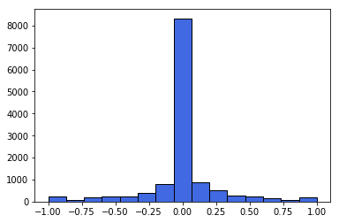

## **Behavioral Cloning Project**

### 1. Dataset overview

Initially, I recorded my driving on track one, there were two full laps (clockwise and counter-clockwise) and a few takes of 
two most difficult turns. However, that wasn't enough for the model (even with sophisticated data preprocessing pipeline) to
successfully drive on track two, so I ended up recording two laps of track two as well.
I had `12757` samples. Each sample was a shot from three cameras (left, center, right) and an angle value.
When I plotted andles distribution I got this:

### 2. Data preprocessing

As we can see dataset contains a lot of `0` values. In order to fix this and to add some 

### Model Architecture and Training Strategy

#### 3. Creation of the Training Set & Training Process

To capture good driving behavior, I first recorded two laps on track one using center lane driving. Here is an example image of center lane driving:

![alt text][image2]

I then recorded the vehicle recovering from the left side and right sides of the road back to center so that the vehicle would learn to .... These images show what a recovery looks like starting from ... :

![alt text][image3]
![alt text][image4]
![alt text][image5]

Then I repeated this process on track two in order to get more data points.

To augment the data sat, I also flipped images and angles thinking that this would ... For example, here is an image that has then been flipped:

![alt text][image6]
![alt text][image7]

Etc ....

After the collection process, I had X number of data points. I then preprocessed this data by ...

I finally randomly shuffled the data set and put Y% of the data into a validation set. 

I used this training data for training the model. The validation set helped determine if the model was over or under fitting. The ideal number of epochs was Z as evidenced by ... I used an adam optimizer so that manually training the learning rate wasn't necessary.
